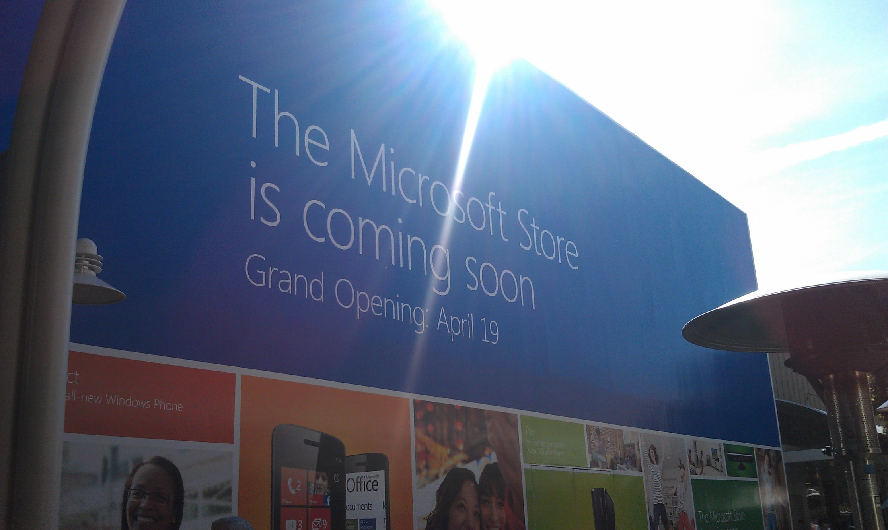
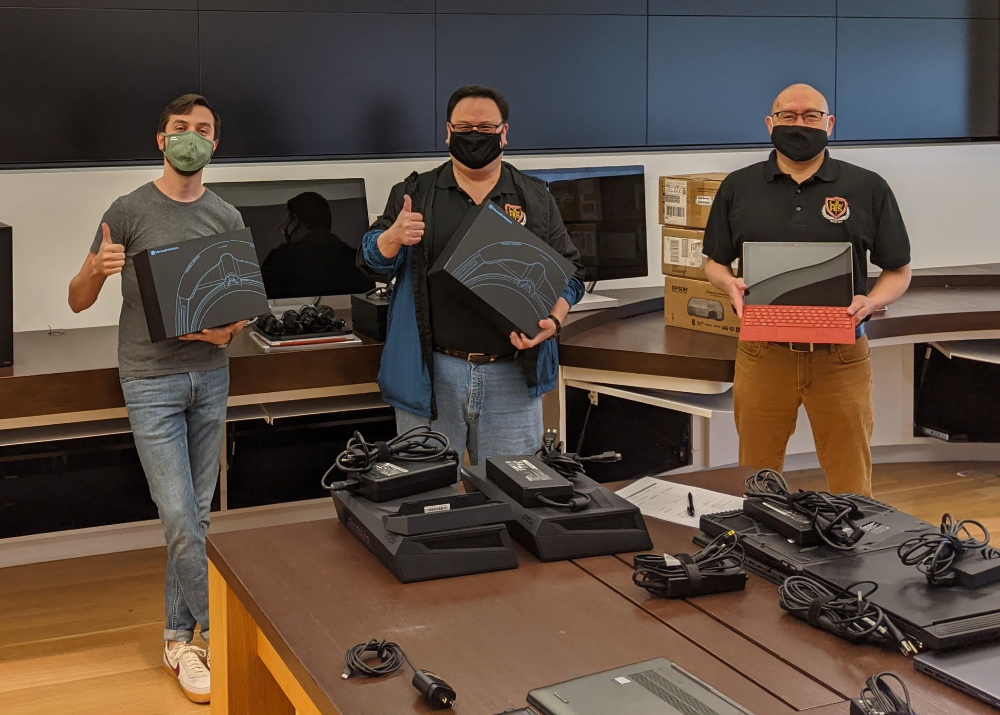
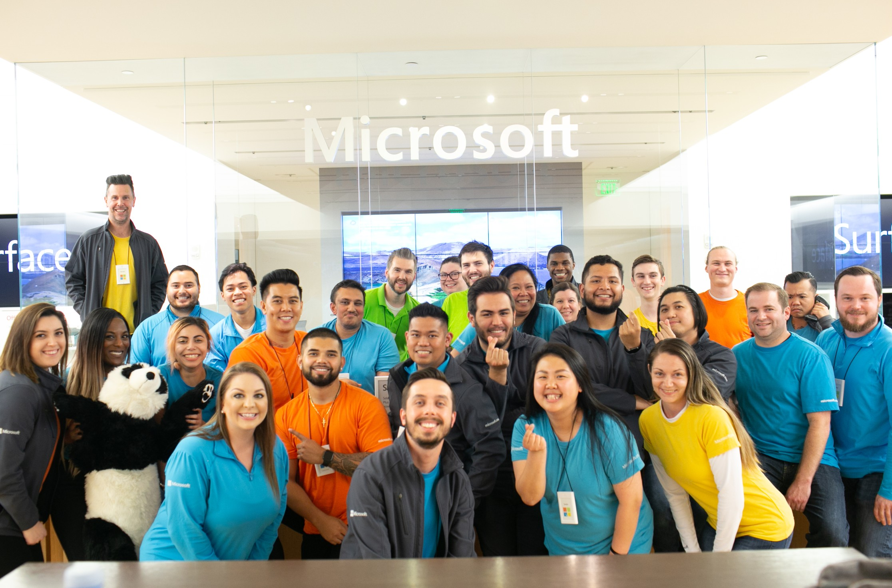

In 2012, I was 18 years old and working at a cupcake shop as a delivery driver. I was just out of high school, going into college, and had no idea what I wanted to do with my life other than that I wanted to work in tech. By chance, one day I delivered cupcakes to the newly opened Microsoft Store in Valley Fair. Upon walking in for the first time, I remember immediately thinking that if a store opened up closer to me, I would love to work there. A few months later, an announcement was made for a new Microsoft Store in Palo Alto, and I jumped on the opportunity. I got to go through the amazing process of NSO (new store opening) and helped to open what was (at the time) the 15th Microsoft Store. In the 9 years since, I have been a Product Advisor, Services Advisor, Learning Specialist, Assistant Store Manager, and Business Sales Specialist during the time when our store did not have one.

It would be impossible to recap my 9 years with this company in just an email, but I am so thankful for all the growth opportunities that have been provided to me by my leaders over the years. What other retailer would send me to New Orleans to help set up a pop-up store at TechEd, allow their Learning Specialist to be the main POC for two of the biggest accounts in the market, send me several times to Redmond for Train the Trainer and to experience HoloLens before we rolled it out to the stores more broadly, send me to Portland for 2 weeks to help their store when they needed additional support, or give me the opportunity to donate thousands of dollars worth of Microsoft products to a customer I originally helped to cultivate? I am leaving so many things out, but man, it has been a wild journey.

My career has been driven by two simple words, and if I could give one piece of advice, this would be it:

**Own It.**

This phrase has been part of our Microsoft Store culture since the beginning and has held true to me throughout my career. Own your own development, both personally and professionally. Actively seek out experiences to grow, don’t wait for them to be given to you. You have more freedom than you may think on how you do your job. Complete the tasks that are required of you first, then expand and focus on extracurricular things.

While the experiences have been unforgettable, the biggest thing that has kept me here for so long are the amazing people I have gotten to work with. I have learned so much by working with and collaborating with amazing people both inside and outside of the retail org. We celebrated each other’s wins, laughed at crazy customer stories, mourned employees who left us too soon, and bonded together outside of work on social Sundays. As cliché as it always sounds, Microsoft employees, especially my fellow retail store employees, are my family.

Early in 2020, I happened to catch an interview with the CEO of a company that was based in New York, and I loved the mission and product they were providing. I told myself that if the opportunity ever presented itself and a position opened up near me that I could apply for, I would. Fortunately, that happened recently. I was lucky enough to receive a job offer and will be joining a team and an industry that I am extremely passionate about. It is certainly bittersweet, but my 9 years at Microsoft is coming to a close this week and my last day will be March 19th.

To close, I just want to say **THANK YOU!** There are a lot of people I have crossed paths with during my time at Microsoft, both internally as well as the fantastic partners and clients I have had the opportunity to work with. If you’re reading this, you likely impacted my career in some way. I am forever grateful for the time that I spent at Microsoft.

Onward and upward! 🚀
