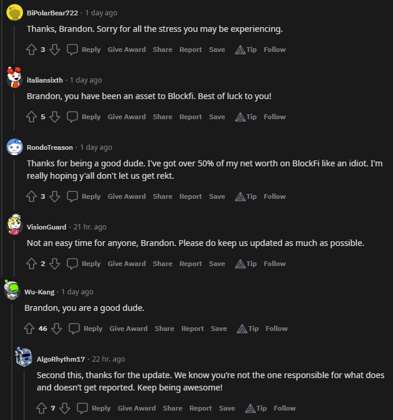

_From the top: These views are my own and do not reflect any official opinions or statements from BlockFi._

This past week has been hard.

To watch the fear and uncertainty unfold within a community that I have spent over a year and a half building, some with names I recognize on a first-name basis, is heartbreaking.

As a Community Manager for BlockFi, my priority is and always has been to be as transparent and authentic as possible. I am so thankful for the trust that BlockFi leadership have placed in me during my time with the company to represent the brand on social.

While we have done some amazing things on Twitter and Instagram, our Reddit community was where I was really able to shine. Since I started, I have grown our Subreddit from 3,000 subscribers to over 23,000 subscribers.

One of the unique things about Reddit is that I am not posting as BlockFi, I am posting as myself. It's given me a unique and valuable opportunity to grow trust within our community in a way that is hard to replicate elsewhere.

Our community doesn't owe me anything, and yet to see praise like this, from people who currently have their funds locked up in a platform they are unable to withdraw from, is an incredibly validating demonstration of the trust I have helped build during my time with BlockFi. A strong community is such an important asset.

All this to say, it looks like my time with BlockFi is nearing a close.

While I find myself turning on the "Open To Work" sign on LinkedIn, I don't find myself leaving crypto. I am excited to continue building, and am overall incredibly bullish for the industry. Bitcoin will survive, as it always has, and I'm not leaving anytime soon!

If you find yourself in need of a Social Media / Community Manager, please do consider reaching out! I'd love to chat. I also know a ton of incredibly talented designers, copywriters, and marketers that I would be happy to connect you with.
