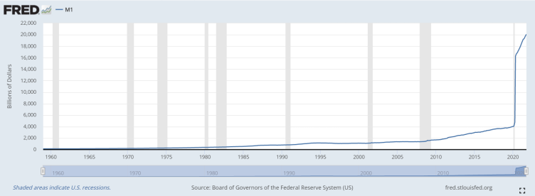

####What a difference a year makes.

About a year and a half ago, I was writing a retrospective on my time with Microsoft and where I thought I was headed. In March of this year, I left Microsoft after over 9 years to work in the crypto industry. So what happened?

It was early in 2017 when a customer walked into my store and started talking to me about cryptocurrency. I had heard of Bitcoin several years prior, but had not really given it much thought. I decided to look into it a bit more after that conversation and subsequently fell down a bit of a rabbit hole.

Towards the end of 2020, I received my annual review from Microsoft and even with my high performance over the year, I received what was the equivalent of a 1.9% raise. When working through HR to determine if that number could be increased further, I found out that the "increase" I received was as good or better than what most of my peers received.

Inflation has been in the news a lot lately. One of the things I grew to learn about Bitcoin was what an "inflation hedge" it was compared to the dollar. While the stimulus checks we all received over the pandemic were welcome, and in some cases highly necessary, the unfortunate side effect was that the literal creation of dollars by the US government significantly affected the rising costs that we are now feeling more than ever. Bitcoin has a hard cap to its supply (21 million) and more can't be created by anyone. This is what makes it a great store of value. Bitcoin is deflationary.

<blockquote class="twitter-tweet">
If you&#39;re saving money, you&#39;re losing money
&mdash; Brandon Marshall 🧙🏻‍♂️ (@marshallmixing) <a href="https://twitter.com/marshallmixing/status/1316519288023384064?ref_src=twsrc%5Etfw">October 14, 2020</a></blockquote>

It may sound counterintuitive, but if you are holding dollars in a savings account, you are losing money over time. One way that US inflation is commonly measured is the Consumer Price Index, or CPI:

> The Consumer Price Index (CPI) is a measure of the average change over time in the prices paid by urban consumers for a market basket of consumer goods and services.

These numbers are updated monthly, and the current annual increase of consumer goods and services (as of November 2021) is 6.8%. Many will argue that the real number is actually higher, but let's just take it at face value for now. What does this 6.8% number mean when considering a 1.9% raise?

####If your employer did not give you at least a 6.8% raise this year, you actually received a pay cut.

I am so grateful for my time with Microsoft and for the lifelong friends and memories I made while working there. This post is not meant to bash Microsoft, but to serve as an example of how most of us are losing money each year to the rising costs of goods and services.

####Fortunately, there is a way out.

I signed up for BlockFi in late 2019 after putting more research into what I could do to combat inflation. I am now earning up to 9% APY on my USD-equivalent deposits there (which happens to be higher than 6.8% if you weren't paying attention). Oh yeah, you can buy and hold Bitcoin there too.

<blockquote class="twitter-tweet">
Bullish on <a href="https://twitter.com/therealblockfi?ref_src=twsrc%5Etfw">@TheRealBlockFi</a> after the latest interview with <a href="https://twitter.com/BlockFiZac?ref_src=twsrc%5Etfw">@BlockFiZac</a> and <a href="https://twitter.com/APompliano?ref_src=twsrc%5Etfw">@APompliano</a>. If that growth ever brings you out to the Bay Area, I&#39;d love to be part of it!
&mdash; Brandon Marshall 🧙🏻‍♂️ (@marshallmixing) <a href="https://twitter.com/marshallmixing/status/1230732418451038209?ref_src=twsrc%5Etfw">February 21, 2020</a></blockquote>

I loved what the company was doing so much that I knew I had to work there. In March of this year, I was lucky enough to get a job at BlockFi. I'm loving every minute of it.

This isn't financial advice. I am not telling you to go and buy Bitcoin or dump your entire net worth into a BlockFi account. But what I am recommending is to look into what you can do to protect your hard-earned savings. Inflation has continued to rise month over month and it doesn't seem to be slowing down anytime soon.

_Disclaimer: I work for BlockFi, but all opinions expressed are fully my own. Most were established before I was working there, anyway._
