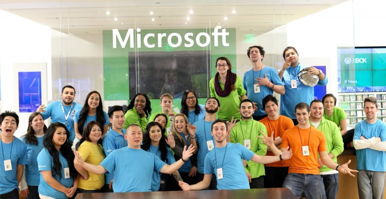

This week marks 8 years since I first walked into the doors of Microsoft, and I wanted to talk about my journey so far.

I first learned about Microsoft Store when I was working in the food industry and dropped off a delivery to the Valley Fair store that had just opened. I remember immediately thinking, "If one of these opens up closer to me, I am absolutely applying!". Luckily, only a few short months later, the announcement was made that Microsoft was opening up a new store in Palo Alto, and I jumped on the opportunity.

I originally applied for the role of Services Advisor, but was instead offered the role of Product Advisor.

As a Product Advisor, I aspired to become the best employee that I could. I still knew that I wanted to be a technician, so I took on as many additional duties as possible, including leading our visual merchandising team to get more hands-on time imaging computers, as well as shadowing and then eventually performing Answers Desk appointments with customers, even though it was not within my normal job duties.

I applied for the Services Advisor role 4 different times before I was offered the role.

As a Services Advisor, I jumped right in and eventually grew into someone that my peers would always come to for support. Eventually I set my sights on a leadership role to continue growing within the store. I took on as many additional duties as I could, including leading our Outlook Mobile Support team, something that was usually reserved for Assistant Store Managers. I also accepted several Career Experience opportunities and got firsthand experience working as an Assistant Store Manager at multiple stores.

I applied for a leadership role 3 different times before I was offered the role of Learning Specialist.

As a Learning Specialist, I took complete ownership of the learning culture in my store. I went above and beyond to schedule touch bases with every employee in the store every month to ensure everyone was getting the attention they deserved. When some of our business team members were out for personal reasons, I jumped in to support the business team and fell in love with solution selling, while also maintaining relationships with our store’s largest commercial accounts when nobody else was in role to support. I have continued to support our commercial business team ever since.

I’ve applied for Business Sales Specialist 2 times, and have not yet been offered the role.

Many people that have been in my position might have stopped trying or gotten complacent, but I have kept pushing. Every rejection has been a learning opportunity and a personal challenge to prove them wrong. I have my store team to thank for allowing me the freedom to branch outside of my traditional responsibilities to support the Microsoft Store team in new ways. It has given me so many opportunities to grow.

My last turn down was in December. But in less than 3 months, I have grown our pipeline by an additional $4.5M, crushed our cloud sales to deliver us past 250% to goal this quarter, and was just awarded MVP for February 💪🏻

Internally we encourage having a growth mindset, and I try to embody this every day. I am hopeful and excited for the next step in my career, but for now I am enjoying the journey.

Onward and upward 🚀
